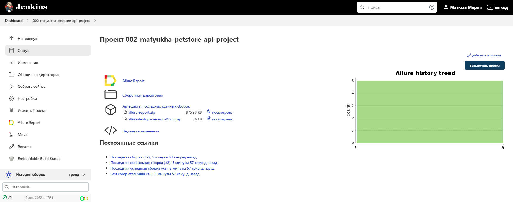
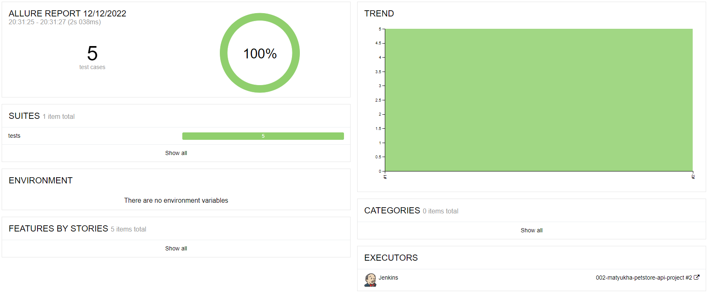
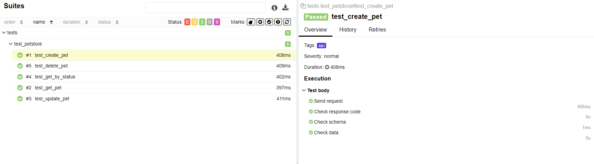
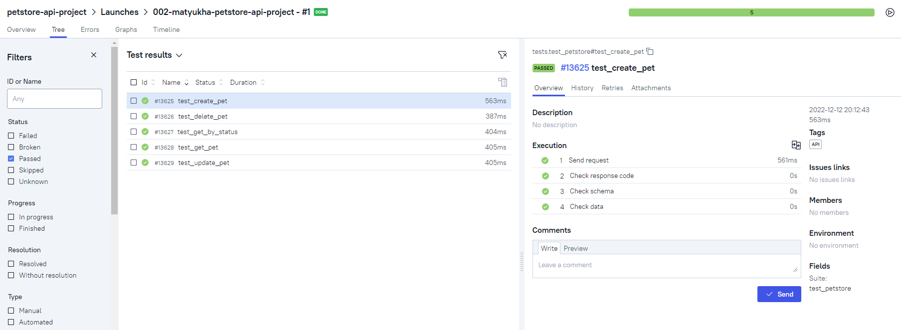
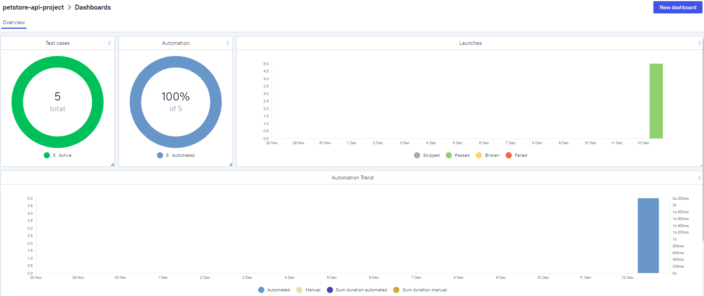
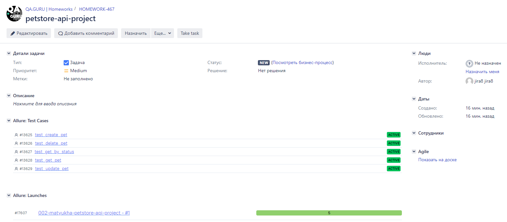

# Проект по тестированию API [Petstore](https://petstore.swagger.io/)

## В проекте используются следующие технологии и инструменты:

## Сборка в [Jenkins](https://jenkins.autotests.cloud/job/002-matyukha-delikateska-ui-project/)

  

## Информация о тестах в [Allure report](https://jenkins.autotests.cloud/job/002-matyukha-petstore-api-project/allure/)

### Главное окно

  

### Окно с кейсами

  

## Интеграция с [Allure TestOps](https://allure.autotests.cloud/project/1746/dashboards)

### Тест-кейсы

  

### Дашборд

  

## Интеграция с [Jira](https://jira.autotests.cloud/browse/HOMEWORK-467)

  

## Уведомление в Telegram

  

